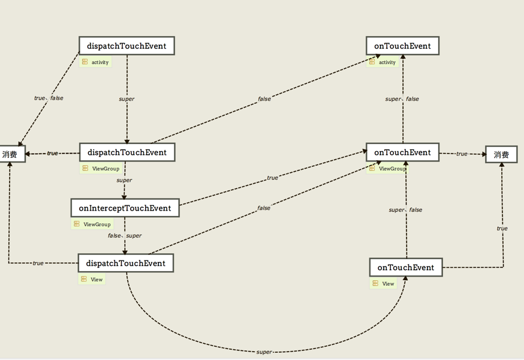

# Android事件传递

## 事件传递


所以如果我们没有对控件里面的方法进行重写或更改返回值，而直接用super调用父类的默认实现，那么整个事件流向应该是从Activity---->ViewGroup--->View 从上往下调用dispatchTouchEvent方法，一直到叶子节点（View）的时候，再由View--->ViewGroup--->Activity从下往上调用onTouchEvent方法。

默认操作都是调用super.xxx方法，会走完U型图的流程
- dispatchTouchEvent
  - false，表示从本层级开始不处理事件，由父控件处理onTouchEvent，从下到上走流程。
  - true，消费事件
  - 注意acitivity中不论返回true/false，都代表消费事件
- onTouchEvent
  - false，交由父控件onTouchEvent处理，，从下到上走流程。
  - true，消费事件
- onInterceptTouchEvent
  - false，不会拦截，继续走子View的dispatchTouchEvent
  - true，交由自己的onTouchEvent处理

**拦截器作用**  
Intercept 的意思就拦截，每个ViewGroup每次在做分发的时候，问一问拦截器要不要拦截（也就是问问自己这个事件要不要自己来处理）如果要自己处理那就在onInterceptTouchEvent方法中 return true就会交给自己的onTouchEvent的处理

dispatchTouchEvent方法能把事件分发到自己的onTouchEvent处理呢，return true和false 都不行，那么只能通过Interceptor把事件拦截下来给自己的onTouchEvent，所以ViewGroup dispatchTouchEvent方法的super默认实现就是去调用onInterceptTouchEvent，记住这一点。

那么对于View的dispatchTouchEvent return super.dispatchTouchEvent()的时候呢事件会传到哪里呢，很遗憾View没有拦截器。但是同样的道理return true是终结。return false 是回溯会父类的onTouchEvent，怎样把事件分发给自己的onTouchEvent 处理呢，那只能return super.dispatchTouchEvent,View类的dispatchTouchEvent（）方法默认实现就是能帮你调用View自己的onTouchEvent方法的。

**事件总结**  
- 对于 dispatchTouchEvent，onTouchEvent，return true是终结事件传递。return false 是回溯到父View的onTouchEvent方法。
- ViewGroup 想把自己分发给自己的onTouchEvent，需要拦截器onInterceptTouchEvent方法return true 把事件拦截下来。
- ViewGroup 的拦截器onInterceptTouchEvent 默认是不拦截的，所以return super.onInterceptTouchEvent()=return false；
- View 没有拦截器，为了让View可以把事件分发给自己的onTouchEvent，View的dispatchTouchEvent默认实现（super）就是把事件分发给自己的onTouchEvent。

## 关于ACTION_MOVE 和 ACTION_UP
上面都是针对ACTION_DOWN的事件传递，ACTION_MOVE和ACTION_UP在传递的过程中并不是和ACTION_DOWN 一样，你在执行ACTION_DOWN的时候返回了false，后面一系列其它的action就不会再得到执行了。

- ACTION_DOWN事件在哪个控件消费了（return true）， 那么ACTION_MOVE和ACTION_UP就会从上往下（通过dispatchTouchEvent）做事件分发往下传，就只会传到这个控件，不会继续往下传，
- ACTION_DOWN事件是在dispatchTouchEvent消费，那么事件到此为止停止传递
- ACTION_DOWN事件是在onTouchEvent消费的，那么会把ACTION_MOVE或ACTION_UP事件传给该控件的onTouchEvent处理并结束传递。

## 简单测试
```java
// ACTION_DOWN
06-26 12:26:56.157 12371-12371/com.free.interview I/MainActivity: dispatchTouchEvent:0
06-26 12:26:56.157 12371-12371/com.free.interview I/CustomLinearLayout: dispatchTouchEvent:0
06-26 12:26:56.157 12371-12371/com.free.interview I/CustomLinearLayout: onInterceptTouchEvent:0
06-26 12:26:56.157 12371-12371/com.free.interview I/CustomTextView: dispatchTouchEvent:0
06-26 12:26:56.157 12371-12371/com.free.interview I/CustomTextView: onTouchEvent:0
06-26 12:26:56.157 12371-12371/com.free.interview I/CustomLinearLayout: onTouchEvent:0
06-26 12:26:56.158 12371-12371/com.free.interview I/MainActivity: onTouchEvent:0
06-26 12:26:56.158 12371-12371/com.free.interview I/ViewRootImpl: finishMotionEvent: handled = false stage=11: Synthetic input stage,inputElapseTime=1 eventTime = 230176713 downTime = 230176713 title= com.free.interview/com.free.interview.MainActivity

// ACTION_UP
06-26 12:26:56.240 12371-12371/com.free.interview I/MainActivity: dispatchTouchEvent:1
06-26 12:26:56.240 12371-12371/com.free.interview I/MainActivity: onTouchEvent:1
```

## 参考资料
- http://www.jianshu.com/p/e99b5e8bd67b
