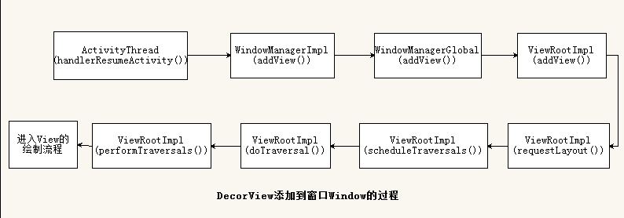

# View的绘制流程
Activity中的PhoneView对象帮我们创建了一个PhoneView内部类DecorView（父类为FrameLayout）窗口顶层视图，然后通过LayoutInflater将xml内容布局解析成View树形结构添加到DecorView顶层视图中id为content的FrameLayout父容器上面。到此，我们已经知道Activity的content内容布局最终会添加到DecorView窗口顶层视图上面，相信很多人也会有这样的疑惑：窗口顶层视图DecorView是怎么绘制到我们的手机屏幕上的呢？

DecorView的绘制流程


View的绘制流程
从ViewRootImpl的performTraversals()开始，依次执行performMeasure()、performLayout()和performDraw()，分别
完成测量、布局和绘制的过程。

## View的Measure过程
DecorView的MesureSpec是由windowSize和他的layoutParams决定的，下面各层View／ViewGroup的MeasureSpec是由上层ViewGroup的MesureSpec和它的layoutParams来决定的。
```
private static int getRootMeasureSpec(int windowSize, int rootDimension) {  
        int measureSpec;  
        switch (rootDimension) {  

        case ViewGroup.LayoutParams.MATCH_PARENT:  
            // Window can't resize. Force root view to be windowSize.  
            measureSpec = MeasureSpec.makeMeasureSpec(windowSize, MeasureSpec.EXACTLY);  
            break;  
        case ViewGroup.LayoutParams.WRAP_CONTENT:  
            // Window can resize. Set max size for root view.  
            measureSpec = MeasureSpec.makeMeasureSpec(windowSize, MeasureSpec.AT_MOST);  
            break;  
        default:  
            // Window wants to be an exact size. Force root view to be that size.  
            measureSpec = MeasureSpec.makeMeasureSpec(rootDimension, MeasureSpec.EXACTLY);  
            break;  
        }  
        return measureSpec;  
```
**MeasureSpec的几种取值**  
- UNSPECIFIED，大小不定
- EXACTLY，指定大小
- AT_MOST，大小可以随内容改变，wrap_content

**performMeasure**  
```
// performMeasure()中调用DecorView设置mView的measure()方法
private void performMeasure(int childWidthMeasureSpec, int childHeightMeasureSpec) {  
        Trace.traceBegin(Trace.TRACE_TAG_VIEW, "measure");  
        try {  
            mView.measure(childWidthMeasureSpec, childHeightMeasureSpec);  
        } finally {  
            Trace.traceEnd(Trace.TRACE_TAG_VIEW);  
        }  
}  
```

**onMeasure**  
所有的View的measure()中灰调用onMeasure()来完成测量，其中View的onMeasure()如下
```java
protected void onMeasure(int widthMeasureSpec, int heightMeasureSpec) {  
    setMeasuredDimension(getDefaultSize(getSuggestedMinimumWidth(), widthMeasureSpec),  
            getDefaultSize(getSuggestedMinimumHeight(), heightMeasureSpec));  
}  
```

**ViewGroup onMeasure**  
但是在ViewGroup中不仅需要测量自己的大小，还需要通过遍历来测量所有子View。而ViewGroup并没有重写View的onMeasure()方法，因为不同的ViewGroup实现类的功能无法用统一的onMeasure()来决定。因此在每个ViewGroup的实现类中都会重写onMeasure()。

下面讲一下重写onMeasure()的思路，具体各种ViewGroup的具体实现类是如何重写的就需要分别看源码。主要分为两部
- setsetMeasuredDimension()确定自己的大小。
- 遍历所有子View，通过递归来完成对所有子View的测量。

在ViewGroup中提供了一个已经写好的遍历方法，可供我们参考，当然我们也可以按照自己的需要来写。
```
protected void measureChildren(int widthMeasureSpec, int heightMeasureSpec) {  
        final int size = mChildrenCount;  
        final View[] children = mChildren;  
        for (int i = 0; i < size; ++i) {  
            final View child = children[i];  
            if ((child.mViewFlags & VISIBILITY_MASK) != GONE) {  
                measureChild(child, widthMeasureSpec, heightMeasureSpec);  
            }  
        }  
}

// 在measureChild()中调用子View的measure()，递归测量所有的View。
protected void measureChild(View child, int parentWidthMeasureSpec,  
            int parentHeightMeasureSpec) {  
        final LayoutParams lp = child.getLayoutParams();  

        final int childWidthMeasureSpec = getChildMeasureSpec(parentWidthMeasureSpec,  
                mPaddingLeft + mPaddingRight, lp.width);  
        final int childHeightMeasureSpec = getChildMeasureSpec(parentHeightMeasureSpec,  
                mPaddingTop + mPaddingBottom, lp.height);  

        child.measure(childWidthMeasureSpec, childHeightMeasureSpec);  
}    
```

## onLayout
measure过程结束后，视图的大小就已经测量好了，接下来就是layout的过程了。在performLayout()中主要执行下面的语句：
`host.layout(0, 0, host.getMeasuredWidth(), host.getMeasuredHeight()); `

View的layout方法
```
public void layout(int l, int t, int r, int b) {  
        if ((mPrivateFlags3 & PFLAG3_MEASURE_NEEDED_BEFORE_LAYOUT) != 0) {  
            onMeasure(mOldWidthMeasureSpec, mOldHeightMeasureSpec);  
            mPrivateFlags3 &= ~PFLAG3_MEASURE_NEEDED_BEFORE_LAYOUT;  
        }  

        int oldL = mLeft;  
        int oldT = mTop;  
        int oldB = mBottom;  
        int oldR = mRight;  

        // 首先通过setFrame(l, t, r, b)来确定自己的位置，然后在onLayout中遍历子View来定位
        boolean changed = isLayoutModeOptical(mParent) ?  
                setOpticalFrame(l, t, r, b) : setFrame(l, t, r, b);  

        if (changed || (mPrivateFlags & PFLAG_LAYOUT_REQUIRED) == PFLAG_LAYOUT_REQUIRED) {  
            onLayout(changed, l, t, r, b);  
            mPrivateFlags &= ~PFLAG_LAYOUT_REQUIRED;  

            ListenerInfo li = mListenerInfo;  
            if (li != null && li.mOnLayoutChangeListeners != null) {  
                ArrayList<OnLayoutChangeListener> listenersCopy =  
                        (ArrayList<OnLayoutChangeListener>)li.mOnLayoutChangeListeners.clone();  
                int numListeners = listenersCopy.size();  
                for (int i = 0; i < numListeners; ++i) {  
                    listenersCopy.get(i).onLayoutChange(this, l, t, r, b, oldL, oldT, oldR, oldB);  
                }  
            }  
        }  

        mPrivateFlags &= ~PFLAG_FORCE_LAYOUT;  
        mPrivateFlags3 |= PFLAG3_IS_LAID_OUT;  
    }  
```
View中的onLayout()是个空方法，因为View已经不需要递归了。VeiwGroup中的onLayout()是一个抽象方法，需要我们来重写。像LinearLayout、RelativeLayout等布局，都是重写了这个方法，然后在内部按照各自的规则对子视图进行布局的。

## onDraw
真正地开始对视图进行绘制，ViewRoot中的代码会继续执行并创建出一个Canvas对象，然后调用View的draw()方法来执行具体的绘制工作。

draw()方法内部的绘制过程总共可以分为六步，其中第二步和第五步在一般情况下很少用到，代码如下所示：
- Draw the background
- If necessary, save the canvas' layers to prepare for fading
- Draw view's content
- Draw children
- If necessary, draw the fading edges and restore layers
- Draw decorations (scrollbars for instance)

第一步的作用是对视图的背景进行绘制。这里会先得到一个mBGDrawable对象，然后根据layout过程确定的视图位置来设置背景的绘制区域，之后再调用Drawable的draw()方法来完成背景的绘制工作。那么这个mBGDrawable对象是从哪里来的呢？其实就是在XML中通过Android:background属性设置的图片或颜色。当然你也可以在代码中通过setBackgroundColor()、setBackgroundResource()等方法进行赋值。

接下来的第三步，这一步的作用是对视图的内容进行绘制。可以看到，这里去调用了一下onDraw()方法，那么onDraw()方法里又写了什么代码呢？进去一看你会发现，原来又是个空方法啊。其实也可以理解，因为每个视图的内容部分肯定都是各不相同的，这部分的功能交给子类来去实现也是理所当然的。

第四步，这一步的作用是对当前视图的所有子视图进行绘制。但如果当前的视图没有子视图，那么也就不需要进行绘制了。因此你会发现View中的dispatchDraw()方法又是一个空方法，而ViewGroup的dispatchDraw()方法中就会有具体的绘制代码。

以上都执行完后就会进入到第六步，也是最后一步，这一步的作用是对视图的滚动条进行绘制。那么你可能会奇怪，当前的视图又不一定是ListView或者ScrollView，为什么要绘制滚动条呢？其实不管是Button也好，TextView也好，任何一个视图都是有滚动条的，只是一般情况下我们都没有让它显示出来而已。绘制滚动条的代码逻辑也比较复杂，这里就不再贴出来了，因为我们的重点是第三步过程。


## 参考资料
- http://blog.csdn.net/wei_lei/article/details/73697445
- http://www.07net01.com/2015/07/866214.html
