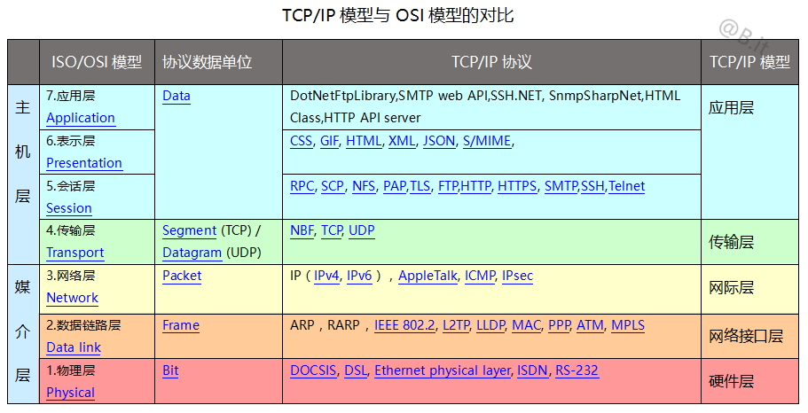
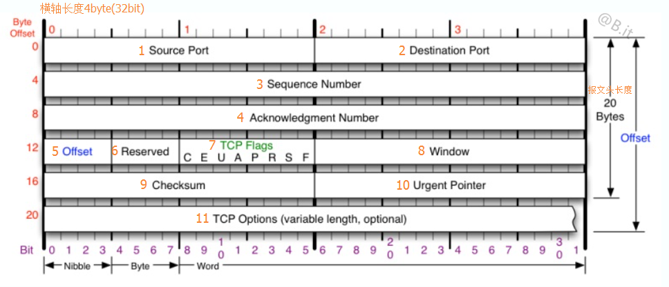
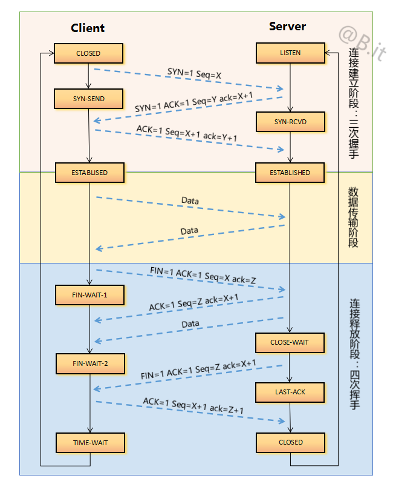

## 网络协议
- 应用层
- 表示层
- 会话层
- 传输层
- 网络层
- 数据链路层
- 物理层

发送请求的过程是从最顶层（应用层）出发，每一层负责封装属于自己的信息到请求中，最后将一整个请求发送给对方。

接收请求的过程是从最底层（网络接口层）开始，每一层的协议负责解析属于自己的东西，比如网际层（IP）处理ip信息，传输层（TCP）处理点对点的端口，应用层（HTTP）处理Request或Response的Line\Header\Body。

## TCP简介
TCP是一种面向连接（连接导向）的、可靠的基于字节流的传输层通信协议。TCP将用户数据打包成报文段，它发送后启动一个定时器，另一端收到的数据进行确认、对失序的数据重新排序、丢弃重复数据。

TCP的特点有：
- TCP是面向连接的运输层协议
- 每一条TCP连接只能有两个端点，每一条TCP连接只能是点对点的
- TCP提供可靠交付的服务
- TCP提供全双工通信。数据在两个方向上独立的进行传输。因此，连接的每一端必须保持每个方向上的传输数据序号。
- 面向字节流。面向字节流的含义：虽然应用程序和TCP交互是一次一个数据块，但TCP把应用程序交下来的数据仅仅是一连串的无结构的字节流。

字节头：固定20字节+TCP可选（40字节），最多60字节。

## TCP三次握手和四次挥手

特别注意
- Seq：是发送方当前报文的顺序号码。
- ack：是发送方期望对方在下次返回报文中给回的Seq。

**建立连接需要三次握手**  
- 第一次握手：客户端向服务端发送连接请求包，标志位SYN（同步序号）置为1，顺序号码为X=0。

- 第二次握手：服务端收到客户端发过来报文，由SYN=1知道客户端要求建立联机，则为这次连接分配资源。并向客户端发送一个SYN和ACK都置为1的TCP报文，设置初始顺序号码Y=0，将确认序号(ack)设置为上一次客户端发送过来的顺序号(Seq)加1，即X+1 = 0+1=1。

- 第三次握手：客户端收到服务端发来的包后检查确认号码(ack)是否正确，即第一次发送的Seq加1（X+1=1）。以及标志位ACK是否为1。若正确，服务端再次发送确认包，ACK标志位为1，SYN标志位为0。确认号码(ack)=Y+1=0+1=1，发送顺序号码(Seq)为X+1=1。Server收到后确认号码值与ACK=1则连接建立成功，可以传送数据了。

**断开连接需要四次挥手**  
提醒：中断连接端可以是Client端，也可以是Server端。只要将下面两角色互换即可。

- 第一次挥手：客户端给服务端发送FIN报文，用来关闭客户端到服务端的数据传送。将标志位FIN和ACK置为1，顺序号码为X=1，确认号码为Z=1。意思是说”我Client端没有数据要发给你了，但是如果你还有数据没有发送完成，则不必急着关闭Socket，可以继续发送数据。所以你先发送ACK过来。”

- 第二次挥手：服务端收到FIN后，发回一个ACK(标志位ACK=1),确认号码为收到的顺序号码加1，即X=X+1=2。顺序号码为收到的确认号码=Z。意思是说“你的FIN请求我收到了，但是我还没准备好，请继续你等我的消息" 这个时候客户端就进入FIN_WAIT状态，继续等待服务端的FIN报文。

- 第三次挥手：当服务端确定数据已发送完成，则向客户端发送FIN报文，关闭与客户端的连接。标志位FIN和ACK置为1，顺序号码为Y=1，确认号码为X=2。意思是告诉Client端“好了，我这边数据发完了，准备好关闭连接了。”

- 第四次挥手：客户端收到服务器发送的FIN之后，发回ACK确认(标志位ACK=1),确认号码为收到的顺序号码加1，即Y+1=2。顺序号码为收到的确认号码X=2。意思是“我Client端知道可以关闭连接了，但是我还是不相信网络，怕 Server端不知道要关闭，所以发送ACK后进入TIME_WAIT状态，如果Server端没有收到ACK则可以重传。Client端等待了2MSL后依然没有收到回复，则证明Server端已正常关闭，那好，我Client端也可以关闭连接了。“（在TIME_WAIT状态中，如果TCP client端最后一次发送的ACK丢失了，它将重新发送。TIME_WAIT状态中所需要的时间是依赖于实现方法的。典型的值为30秒、1分钟和2分钟。等待之后连接正式关闭，并且所有的资源(包括端口号)都被释放。）

**为什么关闭的时候却是四次挥（握）手？**  
因为当Server端收到Client端的SYN连接请求报文后，可以直接发送SYN+ACK报文。其中ACK报文是用来应答的，SYN报文是用来同步的。但是关闭连接时，当Server端收到FIN报文时，很可能并不会立即关闭SOCKET，所以只能先回复一个ACK报文，告诉Client端，"你发的FIN报文我收到了"。只有等到我Server端所有的报文都发送完了，我才能发送FIN报文，因此不能一起发送。故需要四步握手。

## 常用端口
- 7        Echo(PING)           
- 20 /tcp  FTP数据
- 21 /tcp  FTP控制 文件传输协议
- 22 /tcp  SSH 安全登录、文件传送(SCP)和端口重定向
- 23 /tcp  Telnet 不安全的文本传送
- 25 /tcp  SMTP 简单邮件传输协议(Simple Mail Transfer Protocol)(E-mail)
- 53 /tcp  域名服务器
- 69 /udp  TFTP 日常文件传输协议(Trivial File Transfer Protocol)
- 80 /tcp  WWW (HTTP超文本传送协议)
- 110 /tcp  POP3 邮局协议(Post Office Protocol)(E-mail)
- 443 /tcp  HTTPS 经过加密的HTTP(used for securely transferring web pages)
