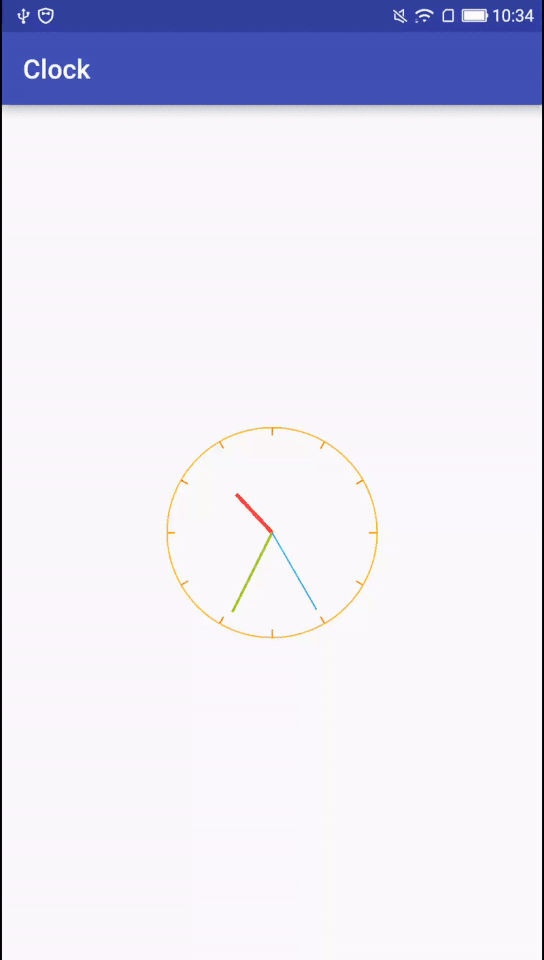

## ClockView
一个漂亮的时钟控件

## 控件效果


## 使用方法
### 简单使用
```java
<com.me.ui.widget.custom.ClockView
        android:layout_width="wrap_content"
        android:layout_height="wrap_content"/>
```

### 自定义属性
```java
 <com.me.ui.widget.custom.ClockView
        xmlns:app="http://schemas.android.com/apk/res-auto"
        android:layout_width="match_parent"
        android:layout_height="wrap_content"
        app:circle_color="@android:color/holo_orange_light"
        app:circle_width="1dp"
        app:clock_radius="80dp"
        app:default_color="@android:color/holo_orange_dark"
        app:graduate_length="6dp"
        app:graduate_width="1dp"
        app:hour_color="@android:color/holo_red_light"
        app:hour_width="3dp"
        app:minute_color="@android:color/holo_green_light"
        app:minute_width="2dp"
        app:second_color="@android:color/holo_blue_light"
        app:second_width="1dp"/>
```