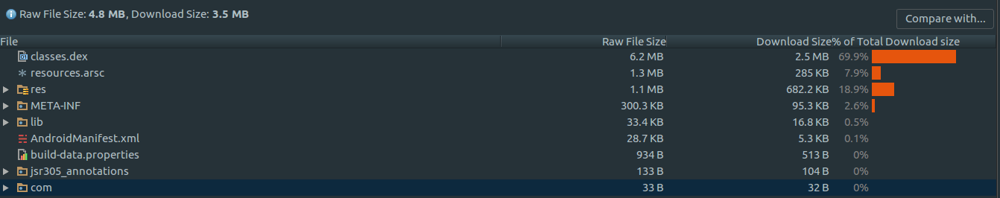
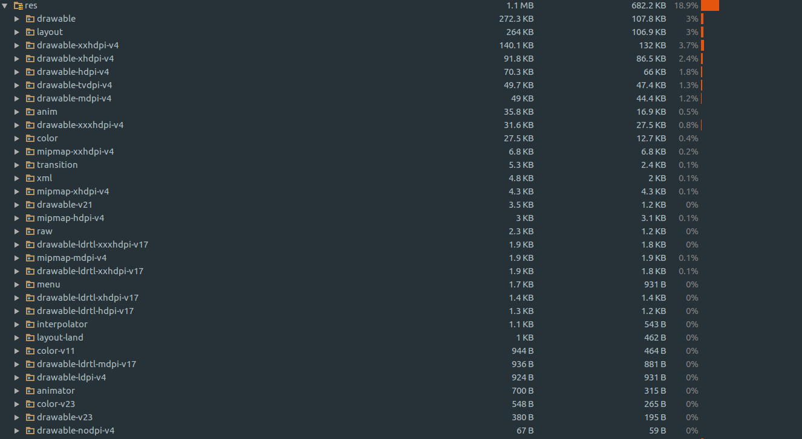
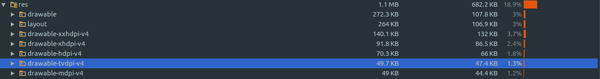
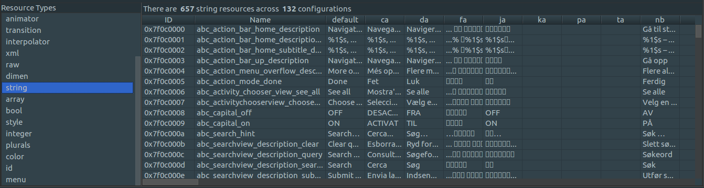
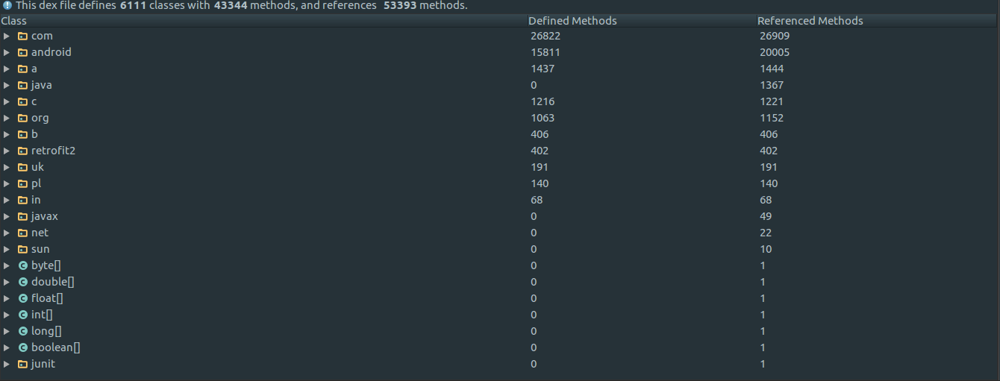

# APK瘦身
随着版本的迭代，功能增加APK体积也会慢慢增大，本文主要介绍APK瘦身的常用方法。


## APK分析
在Android Studio中直接打开APK文件，如下图所示：


APK文件主要由以下几个部分组成：
- classes.dex，是Java源码编译后生成的Java字节码文件，若超出方法数限制，会拆分成多个dex文件。
- resources.arsc，编译后的二进制资源，包括所有索引ID和字符串资源。
- res, 存放图片和资源文件xml
- META-INF，签名信息
- lib， 存放各个CPU架构的so，例如armeabi-v7a，x86
- asserts，存放不需要编译的文件
- AndroidManifest.xml，APK配置文件

主要优化点在：dex，arsc，res, lib


## 优化res
res目录，主要存放图片和资源文件xml

- 优化图片  
  - 小图片，采用svg格式
  - 大图片，采用webp格式，转换工具可以用google的[cwebp](https://developers.google.com/speed/webp/docs/using)

- 资源文件的适配  
  选择合适的图片，目前有l, m, h, xh, xxh, xxxh 等dpi的资源文件，可以选择一套大图片资源去适配。

- 优化资源
  - 通过Lint检查，手动删除不用的资源。
  - 添加shrinkResources，去除无用的资源，该功能依赖混淆开关minifyEnable。

- 移除res下部分资源（一）  
  在gradle中配置，多个文件夹用:隔开
  ```Java
  android {
      // 添加以下配置
      aaptOptions {
        ignoreAssetsPattern 'drawable-tvdpi-v4:drawable-mdpi-v4'
      }
  }
  ```

  例如，移除drawable-tvdpi-v4后，APK体积可减少47KB
  

  support包可移除的资源
    - drawable-tvdpi-v4
    - drawable-mdpi-v4
    - drawable-hdpi-v4
    - drawable-xhdpi-v4
    - drawable-ldrtl-mdpi-v17等

- 移除res下部分资源（二）  
  参考链接：[https://developer.android.com/studio/build/configure-apk-splits.html](https://developer.android.com/studio/build/configure-apk-splits.html)
  ```Java
  android {
    ...
    splits {

      // Configures multiple APKs based on screen density.
      density {

        // Configures multiple APKs based on screen density.
        enable true

        // Specifies a list of screen densities Gradle should not create multiple APKs for.
        exclude "ldpi", "mhdpi", "hdpi"， "xhdpi"

        // Specifies a list of compatible screen size settings for the manifest.
        // compatibleScreens 'small', 'normal', 'large', 'xlarge'
      }
    }
  }
  ```
  优化结果：APK体积减少0.4M。

移除res下部分资源方法比较：
- 第一种方法，是移除res下指定资源文件夹
- 第二种方法，是移除res下某个密度下的资源文件夹


## 优化arsc
arsc文件，记录了资源id和资源的相对关系，比如字符串的内容，图片的相对路径，布局文件的路径。


- 减少语言的支持  
  目前包括各种语言（v4，v7包的引入)，可以看到上图支持132种语言，去除不需要的，保留中英文语言。
  ```Java
  defaultConfig {
      resConfigs "en-rGB", "en-rUS", "zh-rCN", "zh-rHK", "zh-rTW"
  }
  ```
  优化结果：APK的体积减少0.8M。

- 资源混淆  
  参考微信开源解决方案[AndResGuard](https://github.com/shwenzhang/AndResGuard)，通过使用段路径和压缩可以减少APK。  
  上述的开源方案是比较成熟的，可以去查看微信的APK的资源混淆。  
  注意：某些资源需要keep，或者加入白名单。

## 优化dex

- 添加代码混淆  
  设置minifyEnabled true，大部分APP默认都已添加。

- 删除一些无用的库  
  例如兼容低版本手机的库，不再使用的库

- 插件下发业务模块  
  将部分代码延迟下发加载，优化效果显著。

- 删除debug信息   
  一般我们会配置Proguard保留行号等信息用于线上日志分析，极端情况下也可考虑移除这部分，会有5%-10%的效果，但是出于方便性暂未移除。
  ```Java
  // 混淆文件屏蔽以下选项
  // -keepattributes SourceFile,LineNumberTable
  ```

- supportv7包  
  如果对supportv7包依赖的不多，可以直接把使用到的内容copy出来单独处理，毕竟该包会增加至少0.4M的体积，业务复杂后这部分并不好操作和后续维护，头条暂时并没有使用。

## 优化lib
- 只保留armeabi库  
  Android系统目前支持7种不同的CPU架构，每个架构对应一个ABI:
    - armeabi
    - armeabi-v7a
    - arm64-v8a
    - x86
    - x86_64
    - mips
    - mips-64

  例如x86设备可以兼容运行ARM类型函数库，但是不保证100%不发生crash，特别是针对就设备。

  大部分应用只需要保留armeabi或者armeabi-v7a即可。

  可以通过gradle配置ndk编译so的架构：
  ```Java
  defaultConfig {
      ndk {
          abiFilter "armeabi"
      }
  }
  ```

- 动态下发  
  比较大的so文件，可以选择动态下发，应用延迟加载对应的so文件。


## 其他优化
- 优化support-4包  
  Google的support-v4包新版本已经做了拆分，24.2.0版本拆分成了5个module:
    - support-compat
    - support-core-utils
    - support-core-ui
    - support-media-compat
    - support-fragment

  可以根据自己需要单独引用相应的module。 v7包也会依赖v4，maven依赖有个好处，可以通过exclude单独剔除相应依赖。不过目前各家APP对于support包的使用较深，support包各模块也会有相关依赖关系，具体能不能使用还需要看实际情况了。

- 使用ReDex优化  
  https://github.com/facebook/redex  
  这是Facebook开源的一个减小安卓app大小以提高性能的工具，集成的话有风险需要多测试，教程。


## 参考资料
- [头条APK瘦身之路](http://www.toutiao.com/a6420574013538320641/)
