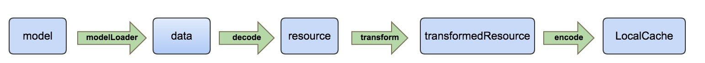

# Glide源码解析


## 功能介绍
Android图片加载框架，支持Video，Gif，SVG格式，支持缩略图请求，打造更好的图片列表滑动体验。Glide有生命周期的概念，可以与Activity和Fragment绑定，默认使用基于HttpUrlConnection的自定义网络层，支持Okhttp和Volley，友好的内存管理和磁盘管理。

## 简单用法
```java
Glide.with(context).load(url).into(imageView);
```

## 框架图


## 基本概念
**Glide**
使用RequestBuilder创建Request的静态接口，并持有Engine，BitmapPool, MemoryCache，各种解码器，转换器。实现了ComponentCallbacks2，注册了低内存回调。当内存不足时，进行内存清理。回调发成在RequestManagerFragment的onLowMemory和onTrimMemory方法中。

**GlideBuild**
为Glide提供一些默认配置，比如Engine, BitmapPool, MemoryCache, DiskCache, DecodeFormat, ExecutorService（包括sourceService, diskCacheService）;

**GlideModule**
可以通过GlideBuild和Glide进行一些延迟配置和Components的注册。
注意：所有的实现的GlideBuild必须是public的，并且只拥有一个空的构造函数，以便Glide懒加载的时候可以通过反射调用。
```java
@Override
public void applyOptions(Context context, GlideBuilder glideBuilder) {
    glideBuilder.setDecodeFormat(DecodeFormat.PREFER_ARGB_8888);
    glideBuilder.setDiskCache(new DiskCache.Factory() {
        @Override
        public DiskCache build() {
            return getDiskCache();
        }
    });
}

@Override
public void registerComponents(Context context, Glide glide) {
    // 内存策略，有低、正常、高三种配置
    glide.setMemoryCategory(MemoryCategory.NORMAL);

    // 给View设置一个唯一的TAG ID
    ViewTarget.setTagId(R.id.glide_request);

    // Other components
    GlideUtils.fixBitmapDrawError(context);
}
```
**Engine**
调度器：任务的创建，发起，回调，资源的管理。

**DecodeerJob**
调度任务的核心类，处理原始的数据或缓存数据，应用转换动画，以及转码。

**ModeLoader**
各种资源的ModelLoader<Model, Data>，将任意复杂的Model转换为可以被Decode的数据类型，允许Model结合View的尺寸，获取特定大小资源。

**Resouce**
对资源进行包装的接口，提供get，recycle，getSize，以及原始类的getResourceClass方法。Resource包下也就是各种资源：bitmap，bytes，drawable，file，gif，以及相关解码器，转换器。

**Target**
request 的载体，各种资源对应的加载类，含有生命周期的回调方法，方便开发人员进行相应的准备以及资源回收工作。

**Request**
每次请求都会新建立一个xxxRequest类

**ThumbnailRequestCoordinator**
请求协调器，包含两个请求：缩略图请求＋完整图片请求.

**Register**
对Glide所支持的Encoder，Decoder，Transcoder组件进行注册, 因为Glide所支持的数据类型太多，把每一种的数据类型及相应处理方式的组合形象化为一种组件的概念。通过registry的方式管理。
如下，注册了将使用BitmapDrawableTranscoder将Bitmap转换为BitmapDrawable的组件。
```java
transcoderRegistry.register(Bitmap.class, GlideBitmapDrawable.class,
      new GlideBitmapDrawableTranscoder(context.getResources(), bitmapPool));
transcoderRegistry.register(GifBitmapWrapper.class, GlideDrawable.class,
      new GifBitmapWrapperDrawableTranscoder(newGlideBitmapDrawableTranscoder(context.getResources(), bitmapPool)));
```
**相关概念**
* data ：代表原始的，未修改过的资源，对应 dataClass
* resource : 修改过的资源，对应 resourceClass
* transcoder : 资源转换器，比如 BitmapBytesTranscoder（Bitmap 转换为 Bytes），GifDrawableBytesTranscoder
* ResourceEncoder : 持久化数据的接口，注意，该类并不与 decoder 相对应，而是用于本地缓存的接口
* ResourceDecoder : 数据解码器,比如 ByteBufferGifDecoder（将 ByteBuffer 转换为 Gif），StreamBitmapDecoder（Stream 转换为 Bitmap）
* ResourceTranscoder : 资源转换器，将给定的资源类型，转换为另一种资源类型，比如将 Bitmap 转换为 Drawable，Bitmap 转换为 Bytes
* Transformation : 比如对图片进行 FitCenter，CircleCrop，CenterCrop 的 transformation，或者根据给定宽高对 Bitmap 进行处理的 BitmapDrawableTransformation

## 基本流程


### 初始化
**初始化GlideBuild**
```java
// 初始化默认配置
Glide createGlide() {
    // 获取数据源线程池，数量为当前可用最大值
    if (sourceService == null) {
        final int cores = Math.max(1, Runtime.getRuntime().availableProcessors());
        sourceService = new FifoPriorityThreadPoolExecutor(cores);
    }

    // 获取磁盘缓存线程池，数量为1
    if (diskCacheService == null) {
        diskCacheService = new FifoPriorityThreadPoolExecutor(1);
    }

    // 根据屏幕的宽和高，图片的像素，计算bitmap pool的大小
    MemorySizeCalculator calculator = new MemorySizeCalculator(context);
    if (bitmapPool == null) {
        if (Build.VERSION.SDK_INT >= Build.VERSION_CODES.HONEYCOMB) {
            int size = calculator.getBitmapPoolSize();
            bitmapPool = new LruBitmapPool(size);
        } else {
            bitmapPool = new BitmapPoolAdapter();
        }
    }

    // 内存缓存
    if (memoryCache == null) {
        memoryCache = new LruResourceCache(calculator.getMemoryCacheSize());
    }

    // 磁盘缓存
    if (diskCacheFactory == null) {
        diskCacheFactory = new InternalCacheDiskCacheFactory(context);
    }

    // 不对外提供接口
    if (engine == null) {
        engine = new Engine(memoryCache, diskCacheFactory, diskCacheService, sourceService);
    }

    // 默认RGB_565格式
    if (decodeFormat == null) {
        decodeFormat = DecodeFormat.DEFAULT;
    }

    return new Glide(engine, memoryCache, bitmapPool, context, decodeFormat);
}
```
**初始化Glide**

Glide初始化部分变量，注册默认components，用户也可以自定义注册
```java
Glide(Engine engine, MemoryCache memoryCache, BitmapPool bitmapPool, Context context, DecodeFormat decodeFormat) {
        this.engine = engine;
        this.bitmapPool = bitmapPool;
        this.memoryCache = memoryCache;
        this.decodeFormat = decodeFormat;
        loaderFactory = new GenericLoaderFactory(context);
        mainHandler = new Handler(Looper.getMainLooper());
        bitmapPreFiller = new BitmapPreFiller(memoryCache, bitmapPool, decodeFormat);

        // 注册data和resource的decoder的encoder，包括bitmap，File，ParcelFileDescriptor, ImageVideo，Gif，ImageVideoGif
        dataLoadProviderRegistry = new DataLoadProviderRegistry();

        StreamBitmapDataLoadProvider streamBitmapLoadProvider =
                new StreamBitmapDataLoadProvider(bitmapPool, decodeFormat);
        dataLoadProviderRegistry.register(InputStream.class, Bitmap.class, streamBitmapLoadProvider);

        FileDescriptorBitmapDataLoadProvider fileDescriptorLoadProvider =
                new FileDescriptorBitmapDataLoadProvider(bitmapPool, decodeFormat);
        dataLoadProviderRegistry.register(ParcelFileDescriptor.class, Bitmap.class, fileDescriptorLoadProvider);

        ImageVideoDataLoadProvider imageVideoDataLoadProvider =
                new ImageVideoDataLoadProvider(streamBitmapLoadProvider, fileDescriptorLoadProvider);
        dataLoadProviderRegistry.register(ImageVideoWrapper.class, Bitmap.class, imageVideoDataLoadProvider);

        GifDrawableLoadProvider gifDrawableLoadProvider =
                new GifDrawableLoadProvider(context, bitmapPool);
        dataLoadProviderRegistry.register(InputStream.class, GifDrawable.class, gifDrawableLoadProvider);

        dataLoadProviderRegistry.register(ImageVideoWrapper.class, GifBitmapWrapper.class,
                new ImageVideoGifDrawableLoadProvider(imageVideoDataLoadProvider, gifDrawableLoadProvider, bitmapPool));

        dataLoadProviderRegistry.register(InputStream.class, File.class, new StreamFileDataLoadProvider());

        // 注册ModelLoaderFactory，获取各种类型资源
        register(File.class, ParcelFileDescriptor.class, new FileDescriptorFileLoader.Factory());
        register(File.class, InputStream.class, new StreamFileLoader.Factory());
        register(int.class, ParcelFileDescriptor.class, new FileDescriptorResourceLoader.Factory());
        register(int.class, InputStream.class, new StreamResourceLoader.Factory());
        register(Integer.class, ParcelFileDescriptor.class, new FileDescriptorResourceLoader.Factory());
        register(Integer.class, InputStream.class, new StreamResourceLoader.Factory());
        register(String.class, ParcelFileDescriptor.class, new FileDescriptorStringLoader.Factory());
        register(String.class, InputStream.class, new StreamStringLoader.Factory());
        register(Uri.class, ParcelFileDescriptor.class, new FileDescriptorUriLoader.Factory());
        register(Uri.class, InputStream.class, new StreamUriLoader.Factory());
        register(URL.class, InputStream.class, new StreamUrlLoader.Factory());
        // 这个是Glide封装的网络请求器
        register(GlideUrl.class, InputStream.class, new HttpUrlGlideUrlLoader.Factory());
        register(byte[].class, InputStream.class, new StreamByteArrayLoader.Factory());

        // 资源转换器，Bitmap和Gif
        transcoderRegistry.register(Bitmap.class, GlideBitmapDrawable.class,
                new GlideBitmapDrawableTranscoder(context.getResources(), bitmapPool));
        transcoderRegistry.register(GifBitmapWrapper.class, GlideDrawable.class,
                new GifBitmapWrapperDrawableTranscoder(
                        new GlideBitmapDrawableTranscoder(context.getResources(), bitmapPool)));

        // Bitmap的转型，包括宽高，缩放类型
        bitmapCenterCrop = new CenterCrop(bitmapPool);
        drawableCenterCrop = new GifBitmapWrapperTransformation(bitmapPool, bitmapCenterCrop);
        bitmapFitCenter = new FitCenter(bitmapPool);
        drawableFitCenter = new GifBitmapWrapperTransformation(bitmapPool, bitmapFitCenter);
    }
```
### 建立请求
**创建RequestManager**
```java
Glide.with(context);
```
Context支持五类参数
* android.app.Activity
* android.support.v4.app.FragmentActivity
* android.app.Fragment
* android.support.v4.app.Fragment
* Context

创建流程
* 创建RequestManagerRetriever单例，实例化一个RequestMnanger，管理Activity和Fragment生命周期。
* 通过Activity和Fragment获取FragmentManager, 并创建一个对应的空页面RequestManagerFragment，添加到FragmentTransaction。
* RequestManagerFragment，管理子RequestManagerFragment，并实例化一个ActivityFragmentLifecycle，并将它传递给RequestManager。
```java
// RequestManagerFragment生命周期管理
@Override
   public void onStart() {
       super.onStart();
       lifecycle.onStart();
   }

   @Override
   public void onStop() {
       super.onStop();
       lifecycle.onStop();
   }

   @Override
   public void onDestroy() {
       super.onDestroy();
       lifecycle.onDestroy();
   }
```

**创建Request**

支持的类型有网络图片，本地图片，应用资源，二进制流，Uri对象等。

加载普通图片，创建DrawableTypeRequest，所有Request的基类为GenericRequestBuilder。
```java
Glide.with(context).load(url);
```

RequestManager实例化DrawableTypeRequest时，会将lifecycle传递给DrawableTypeRequest
```java
return optionsApplier.apply(
             new DrawableTypeRequest<T>(modelClass, streamModelLoader, fileDescriptorModelLoader, context,
                     glide, requestTracker, lifecycle, optionsApplier));
```

DrawableTypeRequest提供类型转换，做一些特殊处理，例如生成bitmap，加载gif，下载图片等。
```java
// 转换为BitmapTypeRequest
asBitmap();

// 转换为GifTypeRequest
asGif();

// 转换为FutureTarget<File>
downloadOnly();
```

**创建Target**

设置资源的Target，并创建，绑定，跟踪，发起请求。可创建多种Target，例如ImageView、自定义Target等。
```java
// 将图片加载到ImageView
into(ImageView);

// 自定义Target，得到图片加载各个状态的和生命周期回调。
into(Y target)；

// 不推荐，使用override(int width, int height).into(target)替代
into(width, height);
```

### Engine任务调度
主要函数
* loadFromCache(Key key, boolean isMemoryCacheable)  
  从内存缓存中获取资源，获取成功后会放入到 activeResources 中

* loadFromActiveResources  
从存活的资源中加载资源，资源加载完成后，再将这个缓存数据放到一个 value 为软引用的 activeResources map 中，并计数引用数，在图片加载完成后进行判断，如果引用计数为空则回收掉。

* getReferenceQueue  
activeResources 是一个持有缓存 WeakReference 的 Map 集合。ReferenceQueue 就是提供资源 WeakReference 的虚引用队列。 activeResources.put(key, new ResourceWeakReference(key, cached, getReferenceQueue()));   
这里要提的是负责清除 WeakReference 被回收的 activeResources 资源的实现：  
使用到了 MessageQueue.IdleHandler，源码的注释：当一个线程等待更多 message 的时候会触发该回调,就是 messageQuene 空闲的时候会触发该回调

* load( GlideContext glideContext, Object model, Key signature, int width, int height, Class resourceClass, Class transcodeClass, Priority priority, DiskCacheStrategy diskCacheStrategy, Map, Transformation<?>> transformations, boolean isTransformationRequired, Options options, boolean isMemoryCacheable, ResourceCallback cb)  
Target.into()、preload、download时，会调度任务

```Java
// load时，会先进行MemoryCache获取，再去调度EngineJob
EngineResource<?> cached = loadFromCache(key, isMemoryCacheable);
  if (cached != null) {
      cb.onResourceReady(cached);
      if (Log.isLoggable(TAG, Log.VERBOSE)) {
          logWithTimeAndKey("Loaded resource from cache", startTime, key);
      }
      return null;
  }
```

真正的开始加载资源，看下面的流程图


### EngineJob
调度DecodeJob，添加、移除资源回调，并回调通知。

* start(EngineRunnable runnable);
开始EngineRunnable，调度decodeJob

* MainThreadCallback
最终的结果，回调主线程

```Java
// Engine.load() 代码片段
EngineJob engineJob = engineJobFactory.build(key, isMemoryCacheable);
DecodeJob<T, Z, R> decodeJob = new DecodeJob<T, Z, R>(key, width, height, fetcher, loadProvider, transformation,
        transcoder, diskCacheProvider, diskCacheStrategy, priority);
EngineRunnable runnable = new EngineRunnable(engineJob, decodeJob, priority);
jobs.put(key, engineJob);
engineJob.addCallback(cb);

// EngineJob调用执行DecodeJob
engineJob.start(runnable);

// cb
public interface ResourceCallback {
    void onResourceReady(Resource<?> resource);
    void onException(Exception e);
}
// RequestBuild的listener就是通过ResourceCallback进行回调
requestBuilder.listener(new RequestListener<String, GlideDrawable>())
```

### EngineRunnable
实现Runnable方法，真正任务执行的地方，持有EngineRunnableManager和DecodeJob

// 任务调度逻辑
```Java
@Override
public void run() {
    // ...
    try {
        resource = decode();
    } catch (Exception e) {
        if (Log.isLoggable(TAG, Log.VERBOSE)) {
            Log.v(TAG, "Exception decoding", e);
        }
        exception = e;
    }

    // ...
    if (resource == null) {
        onLoadFailed(exception);
    } else {
        onLoadComplete(resource);
    }
}
```

// 加载图片逻辑
```Java
// 优先从Cache中获取数据
private Resource<?> decode() throws Exception {
   if (isDecodingFromCache()) {
       return decodeFromCache();
   } else {
       return decodeFromSource();
   }
}

// 加载成功，回调onResourceReady方法
private void onLoadComplete(Resource resource) {
   manager.onResourceReady(resource);
}

// 加载缓存失败，则从Source中获取； 加载Source失败，回调onException。
private void onLoadFailed(Exception e) {
   if (isDecodingFromCache()) {
       stage = Stage.SOURCE;
       // 更改来源，重新执行任务
       manager.submitForSource(this);
   } else {
       manager.onException(e);
   }
}
```

### DecodeJob

// 加载Source流程
```Java
// 获取数据
final A data = fetcher.loadData(priority);

// 解码
decoded = loadProvider.getSourceDecoder().decode(data, width, height);

// 转换
Resource<T> transformed = transformation.transform(decoded, width, height);

// 转码
Resource result = transcoder.transcode(transformed);
```

// 加载Cache流程
```Java
// 加载Cache
Resource<T> transformed = loadFromCache(resultKey);
Resource<Z> result = transcode(transformed);

// Cache中Result为空，则从Cache的Source中获取，再进行转换、转码
Resource<T> decoded = loadFromCache(resultKey.getOriginalKey());
Resource<T> transformed = transformation.transform(decoded, width, height);
Resource result = transcoder.transcode(transformed);
```

**DiskCache key需要注意的地方**
Key有二类，一类为原始Source的Key，另一种为Result的key，二者不一样。使用Download方法下载图片后，获取Cache时需要注意。

### ModelLoader
ModelLoader 是一个工厂接口。将任意复杂的 model 转换为准确具体的可以被 DataFetcher 获取的数据类型。每一个 model 内部实现了一个 ModelLoaderFactory，内部实现就是将 model 转换为 Data

```Java
// 获取DataFetcher
public interface ModelLoader<T, Y> {
    DataFetcher<Y> getResourceFetcher(T model, int width, int height);
}

// 获取Source数据
public interface DataFetcher<T> {
  T loadData(Priority priority) throws Exception;
}
```

## Glide数据处理流程

**主要成员变量**  
- ModelLoaderRegistry ：注册所有数据加载的 loader
- ResourceDecoderRegistry：注册所有资源转换的 decoder  
- TranscoderRegistry：注册所有对 decoder 之后进行特殊处理的 transcoder
- ResourceEncoderRegistry：注册所有持久化 resource（处理过的资源）数据的 encoder
- EncoderRegistry ： 注册所有的持久化原始数据的 encoder

**标准的数据处理流程：**  


Glide 在初始化的时候，通过 Registry 注册以下所有组件， 每种组件由功能及处理的资源类型组成：

组件| 构成
:--|:-- |  
loader |   model＋data＋ModelLoaderFactory  
decoder |    dataClass＋resourceClass＋decoder  
transcoder |  resourceClass＋transcodeClass  
encoder  |    dataClass＋encoder  
resourceEncoder  | resourceClass + encoder
rewind  |    缓冲区处理

Decoder | 数据源 | 解码后的资源 |
:--|:-- |:--  |
BitmapDrawableDecoder   | 	Bitmap              |		Drawable  
StreamBitmapDecoder     |  	InputStream         |  	Bitmap
ByteBufferBitmapDecoder |	  ByteBuffer          |  	Bitmap  
GifFrameResourceDecoder | 	GifDecoder          |	 	Bitmap  
StreamGifDecoder 	      |	  InputStream         | 	GifDrawable  
ByteBufferGifDecoder	  |	  ByteBuffer          |	  Gif	  
SvgDecoder		          |		InputStream	        |   SVG  
VideoBitmapDecoder 	    |	  ParcelFileDescriptor|	  Bitmap  
FileDecoder             |		File                | 	file    


Transcoder | 数据源 | 转换后的资源 |
:--|:-- |:--  |
BitmapBytesTranscoder   | 	Bitmap              |		Bytes  
BitmapDrawableTranscoder     |  	Bitmap         |  	Drawable
GifDrawableBytesTranscoder |	  GifDrawable          |  	Bytes  
SvgDrawableTranscoder | 	Svg          |	 	Drawable  


## 附录

### 遗留问题
1. 懒加载  
  可以使用，解决某些glide.setMemoryCategory(MemoryCategory.NORMAL)需要在主线程运行的问题
2. 缩略图逻辑  
  Glide的缩略图加载逻辑是先加载小图，最终显示大图加载的结果。
3. 图片加载崩溃  
  TODO，为什么要去判断资源是否释放？需解决此问题。
4. 内存过高问题，超过200M  
  Glide的MemoryCache并不高，普通的配置占比为33%~40%，引起内存过高的原因是页面过多，且单个页面占用内存高。
5. 解决Glide下载指定宽高图片  
  TODO，做到只缓存Result，不保存Source。

### 参考资料
* [Glide 源码解析](https://github.com/android-cn/android-open-project-analysis/tree/master/tool-lib/image-cache/glide)

### 图片加载框架
* [Android-Universal-Image-Loader](https://github.com/nostra13/Android-Universal-Image-Loader)，个人发起的项目，Android早期开发比较火，于2015年停止维护。
* [Picasso](https://github.com/square/picasso)，Square公司出品
* [Fresco](https://github.com/facebook/fresco)，Facebook公司出品
