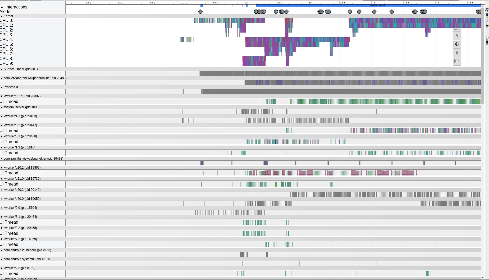
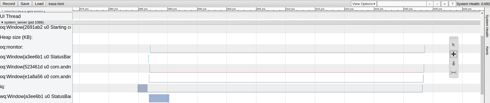
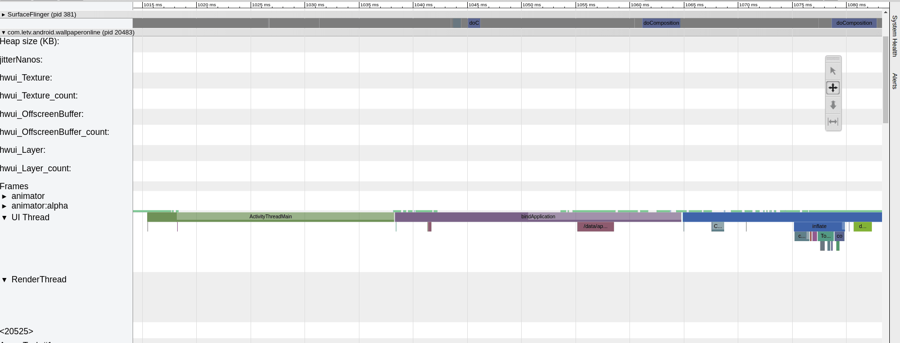
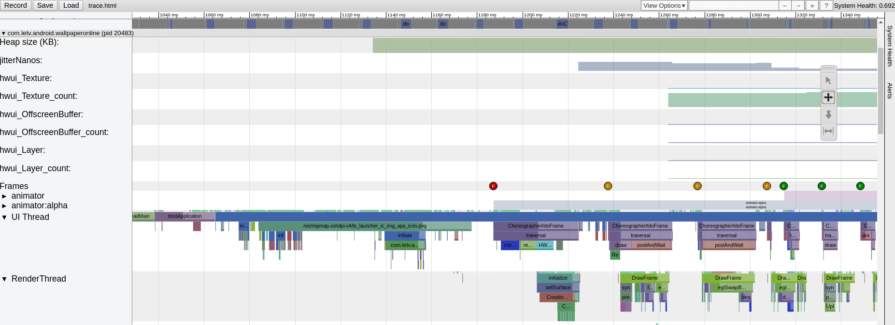
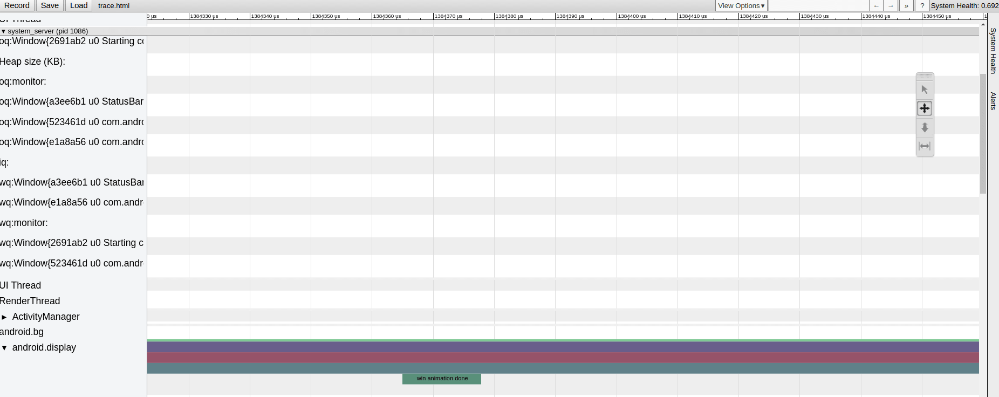

# Android冷启动
Android冷启动时间，从点击应用图标开始，到进入应用后屏幕绘制出第一帧为止。
本文的主要阐述内容为：
- 分析冷启动时间
- 优化冷启动时间

## 常见的分析方法
- 通过Log分析
- 查看Display时间
- 通过Systrace分析，最接近真实启动时间

## Systrace使用方法
进入{sdk-path}/platform-tools/systrace目录，执行以下命令，不需要的模块可以删除
```
python systrace.py gfx input view wm am audio video camera hal res dalvik sched freq idle disk load sync workq -b 50480 -t 5 -o trace.html
```
注意：抓起Systrace时，最好先执行命令，等待1~2秒后，再点击应用图标。

### 分析trace
在Chrome浏览器的地址栏输入：chrome://tracing/，点击load或者将trace文件拖入。

- 左边竖栏代表进程，重点关注system_server和目标应用进程（包名）
- 右边是时间轴
- 可以通过W、S、A、D键，上下左右键，进行缩放或者平移。

### 应用级别添加Trace分析
```Java
Trace.beginSection("Module begin");
// Module code      
Trace.endSection();
```
注意：
- 开始和结束必须在同一个线程，可以与其他的Trace交叉，但是必须与调用次数匹配。
- 执行命令时，你必须通过-a或者-app=来显式地指定应用包名

## 分析冷启动时间

### 开始信号
进入左边的system_server，查找iq或者InputReader，手机会读到多个触摸事件，以第一个值为准，这里为885ms，这个值是绝对时间，不是时间区间。


### 应用进程启动
应用启动流程，创建进程->执行主函数ActivityTreadMain->调用BindApplication，只有冷启动才有BindApplication。

分析Trace文件，进入目标应用进程，查看UI Thread。
- 从开始信号到ActivityTreadMain【浅绿色】时间为1038 - 885 = 153ms
- BindApplication【紫色】的时间为1064 - 1038 = 26ms


### 主Activity启动
从BindApplication的结束点，到Choreographer#DoFrame（编舞者）画出第一帧的结束（finish draw）。  
编舞者的第一帧只做measure和layout，第二帧才执行draw操，第二帧最后的finish draw就是结束标识。  
主Activity启动的时间 = 1266 - 1064 = 202ms

时间分布如下
- 界面绘制，包括inflate、measure、layout、draw，其中inflate时间最长，占用了很长时间。
- 页面的业务逻辑，时间占用很小

重点分析：每个View的inflate时间


### 过场动画
沿着finish draw向下滑动，找到system_server->android.display，向右滑动，最后一个出现 win animation done的地方，就是动画结束的时间点。  
过长动画时间：1384 - 1266 = 118ms


### 冷启动时间
- 开始时间885ms，结束时间1384ms，总时间：499ms
- 事件响应和创建进程时间：153ms
- Application和Activity启动时间：228ms
- 过场动画时间：118ms
- 总结：只有Application和Activity启动时间可以优化，其他时间由系统决定。

## 优化冷启动时间
### 优化原则
- 减少耗时操作
- 减少View的绘制的时间

### 较少耗时操作
- 初始化，Application和Activity主线程尽量不出现耗时操作，尽量放到子线程。
- 懒加载，原则是某个类用到时，再去实例化并初始化，常见的是单例类。

### Glide的懒加载
通过实现GlideModule，进行懒加载
```Java
public class GlideModuleImpl implements GlideModule {
    @Override
    public void applyOptions(Context context, GlideBuilder glideBuilder) {
        glideBuilder.setDecodeFormat(DecodeFormat.PREFER_ARGB_8888);
        glideBuilder.setDiskCache(new DiskCache.Factory() {
            @Override
            public DiskCache build() {
                // TODO
            }
        });
    }

    @Override
    public void registerComponents(Context context, Glide glide) {
        glide.setMemoryCategory(MemoryCategory.NORMAL);
        ViewTarget.setTagId(R.id.glide_request);
    }
```

### 减少View的绘制时间
- 空白页采用ViewStub方式加载，可以减少10ms+的inflate时间
- 布局尽量采用FrameLayout方式

## 拓展
### FSW
在启动某个应用时(点击桌机应用图标)，系统(wms)为了快速响应此action, 会先根据目的activity的主题构造出一个窗口，而这个窗口通常只显示了actionBar, 背景色，这个就是传说中的starting window。因为此窗口和目的窗口在视图内容上有很大区别，所以让用户感觉到应用启动很慢。

为了尽可能的消除这个视觉落差，我们在原生的思想上，对starting window做了扩展，我们暂时叫它FSW(Fake starting window)

使用FSW后，从用户角度来看，减少冷启动时间。
