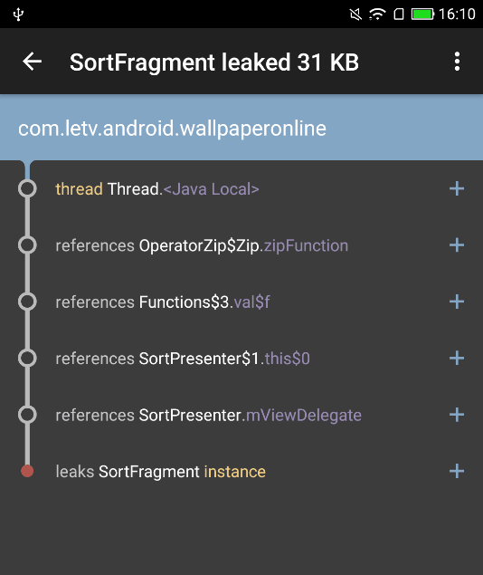
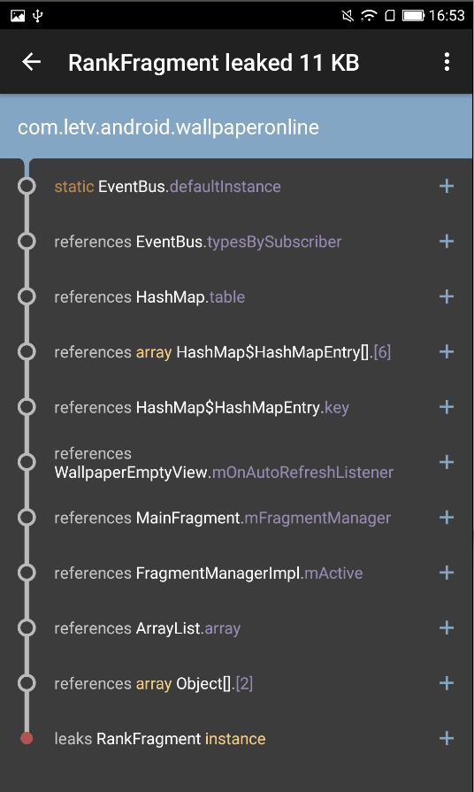

# Android内存泄露
简单来说，就是该被释放的对象没有释放，一直被某个或某些实例所持有却不再被使用，导致GC不能回收

## 虚拟机内存分配
简单来说分为堆和栈，具体分类如下
- 堆，程序运行时直接new出来的内存，也就是对象的实例。
- 方法区，存放class,静态数据和常量，属于堆的一部分，编译时就分配好好了，程序运行期间都存在。
- 栈，当方法被执行时，方法体内的局部变量都在栈上创建，执行结束时内存将会自动被释放。
  - 虚拟机栈，在创建线程的同时创建的，用于存储栈帧，局部变量表，操作数栈
  - 本地方法栈，它用来支持native方法的执行
- 程序计数器，记载着每一个线程当前运行的JAVA方法的地址，唯一不会发生OOM的区域。

`一般来说，都是堆上分配的内存出现泄露，导致GC无法回收。`

## 引用的类型
- 强引用（StrongReference），任何时候GC是不能回收他的，哪怕内存不足时，系统会直接抛出异常OutOfMemoryError，也不会去回收。
- 软引用（SoftReference），当内存足够时不会回收这种引用类型的对象，只有当内存不够用时才会回收。
- 弱引用（WeakReference），	GC一运行就会把给回收了。
- 虚引用（PhantomReference），如果一个对象与虚引用关联，则跟没有引用与之关联一样，在任何时候都可能被垃圾回收器回收。

``开发时，为了防止内存溢出，处理一些比较占用内存并且生命周期长的对象时，可以尽量使用软引用和弱引用。``

## 检测内存泄露的方法
- Lint，进行代码静态分析
- Leakcanary，集成该工具
- MAT，查看内存占用情况
- dumpsys，通过adb shell dumpsys meminfo packagename -d命令，在进入一个界面之前查看一遍Activity和View的数量，需要手动触发GC

## 常见内存泄露
内存泄露主要原因是生命周期不一致、资源没有释放。
- [单例](#单例)（主要原因还是因为一般情况下单例都是全局的，有时候会引用一些实际生命周期比较短的变量，导致其无法释放）
- [静态变量](#静态变量)（同样也是因为生命周期比较长）
- [Handler](#handler)（生命周期比较长）
- [匿名内部类](#匿名内部类)（匿名内部类会引用外部类，导致无法释放，比如各种回调）
- [资源使用完未关闭](#资源使用完未关闭)（BraodcastReceiver，ContentObserver，File，Cursor，Stream，Bitmap, Listener）

### 单例
通常来说，单例的生命周期和应用一样长，所以如果使用不恰当的话，很容易造成内存泄漏。
```Java
public class AppManager {
    private static AppManager instance;
    private Context context;

    private AppManager(Context context) {
        this.context = context;
    }

    public static AppManager getInstance(Context context) {
        if (instance == null) {
            instance = new AppManager(context);
        }
        return instance;
    }
}
```
这是一个普通的单例模式，当创建这个单例的时候，由于需要传入一个Context，所以这个Context的生命周期的长短至关重。  
如果是Activity的Context，就有可能造成内存泄露。正确的做法是不传或者使用Application的Context。

### 静态变量
如果成员变量被声明为static，那我们都知道其生命周期将与整个app进程生命周期一样，不再使用时，应该将静态变量置空。  
特别要注意静态对象、全局性集合等的生命周期，尽可能的少使用静态变量。

### Handler
生命周期与Activity是不一致的，导致内存泄露，同理还包括Thread、AsyncTask。
- 使用内部静态类 + WeakReference  
```Java
private static class MyHandler extends Handler {
    private final WeakReference<Activity> mActivity;

    public MyHandler(Activity activity) {
        mActivity = new WeakReference<Activity>(activity);
    }

    @Override
    public void handleMessage(Message msg) {
        Activity activity = mActivity.get();
        if (activity != null) {
            // ...
        }
    }
}
```
- Handler引用的实例生命周期结束时，调用removeCallbacksAndMessages(null)

### 匿名内部类
使用了匿名类，并被异步线程持有了，那要小心了，如果没有任何措施这样一定会导致泄露。例如AsyncTask，Runnable，Rxjava的异步操作。
```Java
new AsyncTask<Void, Void, Void>() {
         @Override protected Void doInBackground(Void... params) {
             // TODO 耗时任务
         }
     }.execute();
```

### 资源使用完未关闭
使用以下资源时，需要特别注意：
- BraodcastReceiver
- ContentObserver
- File
- Cursor
- Stream
- Bitmap
- TypedArray，自定义View使用后，需要recycle
- Listener，如果是以Add的方式添加到集合，需要从集合中移除。

## 案例分析
### MVP模式Presenter内存泄露


相关代码如下
```Java
public class SortPresenter {

    private CompositeSubscription mCompositeSubscription;
    private ViewDelegate mViewDelegate;

    private SortPresenter(ViewDelegate viewDelegate) {
        this.mViewDelegate = viewDelegate;
    }

    public void getData() {
        Observable observable1 = Observable.just(1).map(new Func1() {
            @Override
            public Object call(Object o) {
                // TODO 耗时操作
                return 0;
            }
        });

        Observable observable2 = Observable.just(2).map(new Func1() {
            @Override
            public Object call(Object o) {
                // TODO 耗时操作
                return o;
            }
        });

        Subscription subscription = Observable.zip(observable1, observable2, new Func2() {
                    @Override
                    public Object call(Object o, Object o2) {
                        // TODO 数据处理
                        return o;
                    }
                }).subscribeOn(Schedulers.io())
                .unsubscribeOn(Schedulers.io())
                .observeOn(AndroidSchedulers.mainThread())
                .subscribe(new Subscriber<Object>() {
                    @Override
                    public void onCompleted() {

                    }

                    @Override
                    public void onError(Throwable e) {
                        mViewDelegate.showError(e);
                    }

                    @Override
                    public void onNext(Object o) {
                        mViewDelegate.upateUI(o);

                    }
                });
        addSubscription(subscription);
    }

    protected void addSubscription(Subscription s) {
        if(s == null){
            return;
        }
        if (mCompositeSubscription == null) {
            mCompositeSubscription = new CompositeSubscription();
        }
        mCompositeSubscription.add(s);
    }

    public void unSubscribe() {
        mCompositeSubscription.clear();
    }
}
```
泄露原因：``RxJava的Subscription取消订阅后，除了Subscriber订阅方法会不执行外，io线程会继续执行。匿名内部类持有外部Presenter类的引用，而Presenter持有mViewDelegate的引用，导致页面的实例被引用。``

解决办法：``在unSubscribe方法中，添加mViewDelegate = null，注意mViewDelegate判空处理。``

### EventBus内存泄露


泄露原因：`注册EventBus后，没有反注册`

解决办法：
- EventBus一定是注册和反注册成对出现，必要的时候可以在页面的生命周期调用。
- 空白页外部设置的Listener也需要移除监听。
- 空白页使用ViewStub。

### 集合类泄露
- AccountManager.accountChangeListeners
- ImgFulScreenHelper.observers

解决办法：``注意反注册``

### 案例待续
TODO

## 参考文献
- [Android 内存优化总结&实践](https://mp.weixin.qq.com/s?__biz=MzA3NTYzODYzMg==&mid=2653578816&idx=1&sn=20b6160e92167dde676561f3a43d0860&chksm=84b3b447b3c43d51c8042b58fef7dcb2755bdb4ceffaf8244b1e88acc6231411e3e9a5f0368f&mpshare=1&scene=1&srcid=0623T6sejVLAMm0mmBWtmzMD&pass_ticket=Is1sz9cKq2I%2Fnw7fHOy3A0Tcujk6c8qUMC0dA8YQa8G%2FhvQ09cMNv2%2FgOXLCDyEJ#rd)

- [Android应用内存泄露分析、改善经验总结-腾讯质量开放平台](http://wetest.qq.com/lab/view/107.html)

- [Android 内存泄漏总结](https://github.com/GeniusVJR/LearningNotes/blob/master/Part1/Android/Android%E5%86%85%E5%AD%98%E6%B3%84%E6%BC%8F%E6%80%BB%E7%BB%93.md)

- [Android性能优化-内存泄漏的8个Case](https://mp.weixin.qq.com/s?__biz=MzAxMTI4MTkwNQ==&mid=2650822597&idx=1&sn=462b116f97623f239ecf667d3bdef446&chksm=80b7835bb7c00a4d4cbc9f7e19829d9a99f3cf58c1bc43dace16ffec58c98668927c9fa8dcda&mpshare=1&scene=1&srcid=0623cTfpiLctbTHidmS8PNAq&pass_ticket=Is1sz9cKq2I%2Fnw7fHOy3A0Tcujk6c8qUMC0dA8YQa8G%2FhvQ09cMNv2%2FgOXLCDyEJ#rd)
